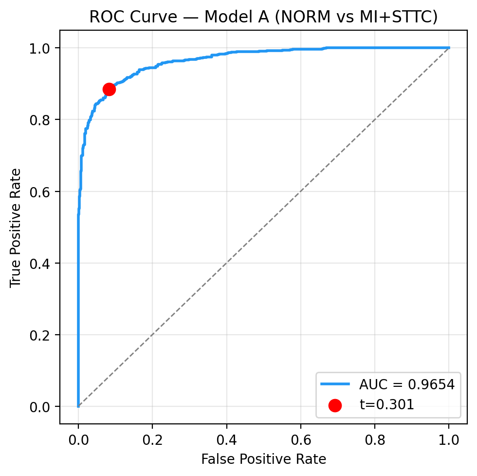
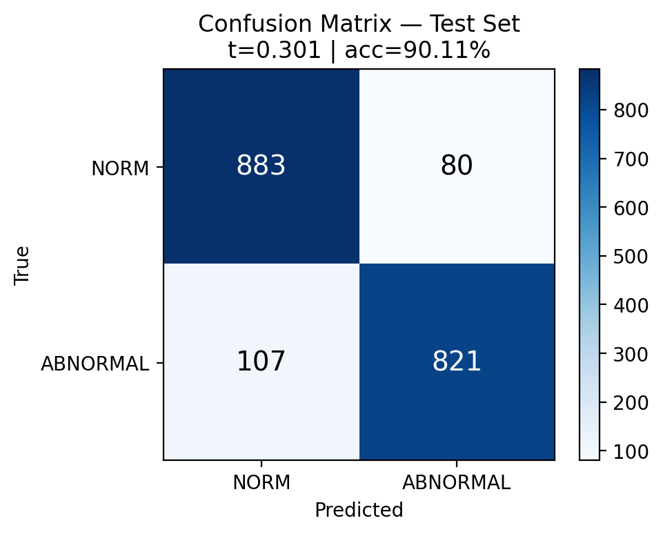
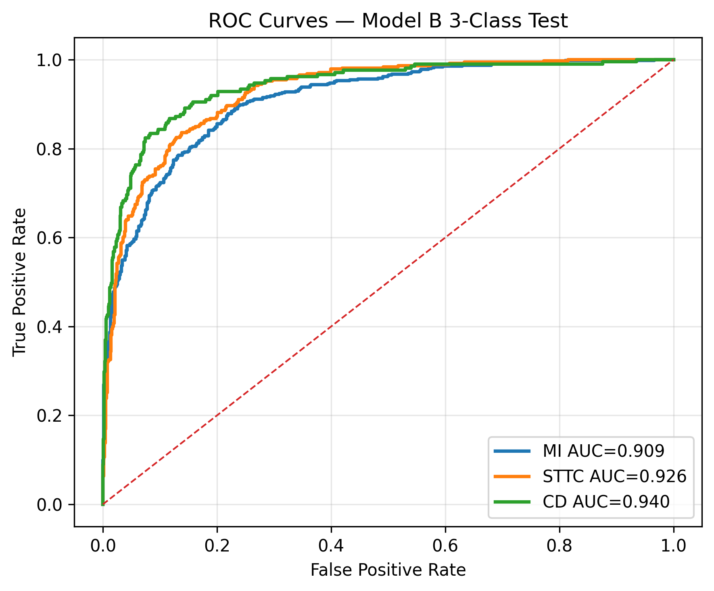
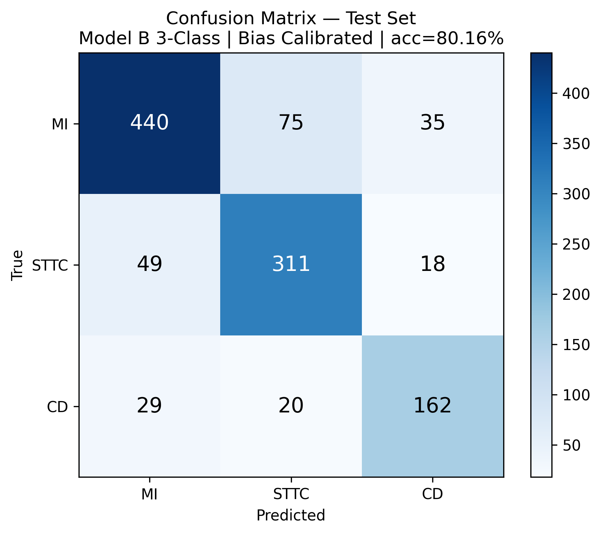

# ECGligne — Intelligent 12-Lead ECG Telesurveillance & AI Diagnosis

> **AI inference pipeline** for a cardiac telesurveillance system based on **12-lead ECG** signals.
> A deep-learning ensemble reads a 10-second, 500 Hz, 12-lead ECG and returns
> **NORMAL** or one of three pathological groups — **MI** (Myocardial Infarction),
> **STTC** (ST/T Change), or **CD** (Conduction Disturbance).

<p align="left">
  
  
  
  
</p>

This repository contains the **AI server and inference code** of a Master's thesis project
(*Détection des décompensations cardiaques par IA embarquée*, University of Oran 1, 2026).
The full system also includes an ESP32 acquisition device, a patient mobile app and a
physician desktop app; this repo focuses on the **reproducible AI / signal pipeline**.

> ⚠️ **Medical disclaimer.** This is a **research prototype**, not a certified medical
> device. It is intended for research and educational use only and must **not** be used
> for real clinical diagnosis. The final medical decision always remains with a qualified
> physician.

---

## Table of contents
- [How it works](#how-it-works)
- [Results](#results)
- [Repository layout](#repository-layout)
- [Installation](#installation)
- [Running the AI server](#running-the-ai-server)
- [End-to-end hardware chain](#end-to-end-hardware-chain-esp32--ble--ai)
- [Model weights & data](#model-weights--data)
- [Dataset & citation](#dataset--citation)
- [Authors](#authors)
- [License](#license)

---

## How it works

The system decides in a **cascade of three hybrid models**, so that a normal ECG is
confidently filtered out before any pathology is named:

```
                 ┌─────────────────────────────────────────────┐
 12-lead ECG ──► │  Model A   NORM vs (MI+STTC)      thr = 0.301│─┐
 (5000 × 12,     └─────────────────────────────────────────────┘ │
  500 Hz, mV)    ┌─────────────────────────────────────────────┐ │  pA < thr ─► NORMAL
            ────►│  Model A1  NORM vs (MI+STTC+CD)   thr = 0.315│─┤  else, pA1 < thr ─► NORMAL
                 └─────────────────────────────────────────────┘ │  else ▼
                 ┌─────────────────────────────────────────────┐ │
                 │  Model B3  MI / STTC / CD  (softmax)         │─┘► argmax ─► MI | STTC | CD
                 └─────────────────────────────────────────────┘
```

Every model is a **hybrid ensemble** of three heterogeneous 1-D architectures, so that each
captures what the others miss:

| Branch | Idea | Notes |
|---|---|---|
| **ResNetHybrid** | Deep 1-D residual net + **Squeeze-and-Excitation** blocks, dilated convolutions | primary model, initialized from a **SimCLR** self-supervised encoder (~9.76 M params) |
| **InceptionHybrid** | Multi-scale parallel kernels + an **FFT** (frequency) branch | ~0.65 M params |
| **TCNHybrid** | Dilated causal convolutions (dilation 1→64) for long-range rhythm | ~0.92 M params |

Beyond the raw signal, each model also receives **auxiliary inputs**:
patient **metadata** (age, sex, BMI, heart axis…), **16 hand-crafted ECG features**
(heart rate, RR stats, QRS duration, signal energy, lead flatness…), and
**10 clinical-rule activations** (bradycardia, tachycardia, wide QRS, baseline wander…).
Inference averages **5 stratified folds × 3 architectures = 15 models**, with
**Test-Time Augmentation (TTA ×8)**.

---

## Results

Evaluated on the official **PTB-XL** stratified test fold (fold 10), unseen during training.

### Binary screening — NORMAL vs ABNORMAL

| Metric | Value |
|---|---|
| **Accuracy** | **90.11 %** |
| **AUC-ROC** | **0.9654** |
| F1-score (macro) | 90.10 % |
| Sensitivity (recall ABNORMAL) | 88.47 % |
| Specificity (recall NORM) | 91.69 % |
| Confusion (TN / FP / FN / TP) | 883 / 80 / 107 / 821 |

<sub>Per-artifact reports: **Model A** (NORM vs MI+STTC) — OOF Acc 90.96 %, AUC 0.9703 ·
**Model A1** (NORM vs MI+STTC+CD) — Test Acc 88.63 %, AUC 0.9551. See [`results/`](results/).</sub>

<p align="left">
  
  
</p>

### Multiclass diagnosis — MI / STTC / CD

**Overall accuracy 80.16 %**, macro AUC **0.925**.

| Class | Precision | Recall | F1-score | AUC | Support |
|---|---|---|---|---|---|
| **MI** — Myocardial Infarction | 0.849 | 0.800 | 0.824 | 0.909 | 550 |
| **STTC** — ST/T Change | 0.766 | 0.823 | 0.793 | 0.926 | 378 |
| **CD** — Conduction Disturbance | 0.753 | 0.768 | 0.761 | **0.940** | 211 |
| **Macro avg** | 0.790 | 0.797 | 0.793 | 0.925 | 1139 |

Pairwise separability: **STTC vs CD** 91.0 % (AUC 0.948) · **MI vs CD** 89.5 % (AUC 0.935) ·
**MI vs STTC** 85.2 % (AUC 0.919 — the hardest pair, as infarction and repolarization
changes share morphology).

<p align="left">
  
  
</p>

When several pathologies coexist, labels follow a clinically-motivated priority
**MI > STTC > CD**, so the most time-critical condition is never masked.

---

## Repository layout

```
ECG_Final_Pipeline/
├── ai_server.py            # FastAPI server — POST /predict_ecg  (.hea + .dat → diagnosis)
├── predict.py             # standalone cascade decision logic (pA, pA1, B3 → label)
├── predict_live_ecg.py    # 5-fold ensemble inference on a live .npy ECG
├── model_defs.py          # architectures (ResNet/Inception/TCN hybrids) + feature/rule extraction
├── send_ecg_to_esp32.py   # stream a real PTB-XL ECG to the ESP32 over USB serial
├── esp_diag.py / esp_monitor.py   # ESP32 serial diagnostics
├── esp32_ecg_real_ecg/    # ESP32 firmware (Arduino .ino) — receives ECG, streams via BLE
├── results/               # per-model JSON metric reports (committed)
├── docs/figures/          # ROC curves & confusion matrices used above
└── GUIDE_TEST.txt         # step-by-step end-to-end test guide (FR)
```

Model weights (`*.pt`) and the PTB-XL–derived arrays (`*.npy`) are **not** committed — see
[Model weights & data](#model-weights--data).

---

## Installation

Requires **Python 3.10+** (developed on 3.12) and, optionally, a CUDA GPU (CPU also works).

```bash
git clone https://github.com/tlemsaniahlem908-cmd/ECGligne.git
cd ECGligne
python -m venv .venv && source .venv/bin/activate   # Windows: .venv\Scripts\activate
pip install -r requirements.txt
```

---

## Running the AI server

The server loads the three models and exposes a single endpoint that accepts a WFDB
record (`.hea` + `.dat`, 12-lead, 500 Hz):

```bash
python -m uvicorn ai_server:app --host 0.0.0.0 --port 8000
# → "Models loaded successfully" + "Uvicorn running on http://0.0.0.0:8000"
```

Example response from `POST /predict_ecg`:

```json
{
  "success": true,
  "prediction": "MI",
  "pA": 0.981, "pA1": 0.974,
  "B3": { "MI": 0.514, "STTC": 0.477, "CD": 0.009 },
  "fs": 500, "shape": [5000, 12],
  "leads": ["I","II","III","AVR","AVL","AVF","V1","V2","V3","V4","V5","V6"]
}
```

You can also run the offline ensemble on a stored signal: `python predict_live_ecg.py`.

---

## End-to-end hardware chain (ESP32 → BLE → AI)

```
Python (real PTB-XL ECG) --USB--> ESP32 --BLE--> Mobile app --WiFi--> AI server --> diagnosis
```

The full test procedure (flashing the ESP32, launching the server, streaming a real ECG)
is documented in [`GUIDE_TEST.txt`](GUIDE_TEST.txt).

---

## Model weights & data

To keep the repository lightweight, the following are **excluded** from git:

- **Model weights** — thirty ResNet checkpoints (~1.1 GB) plus their per-fold normalization
  stats. They will be published as a **GitHub Release** / external archive. Once downloaded,
  restore the `model_A/`, `model_A1/`, `model_B3/` folders at the repo root.
- **PTB-XL processed arrays** (`ptbxl_processed_*/`, ~12 GB) — these are **derived from
  PTB-XL** and are **not redistributed** here for licensing reasons. Regenerate them from
  the official dataset with the preprocessing described in the thesis.

---

## Dataset & citation

This work uses **PTB-XL**, a large publicly available 12-lead ECG dataset (21,799 records,
18,885 patients, 500 Hz, 10 s), obtained from PhysioNet under its own license — please
cite it if you use this pipeline:

> Wagner, P., Strodthoff, N., Bousseljot, RD., Kreiseler, D., Lunze, F.I., Samek, W.,
> Schaeffter, T. (2020). *PTB-XL, a large publicly available electrocardiography dataset.*
> Scientific Data 7, 154. https://doi.org/10.1038/s41597-020-0495-6

If you use this repository, please also cite the thesis (see [`CITATION.cff`](CITATION.cff)).

---

## Author

- **Tlemsani Ahlem** — Computer Science Department, University of Oran 1 Ahmed Ben Bella, Algeria (2026).

---

## License

Released under the **MIT License** — see [`LICENSE`](LICENSE).
The MIT license covers the **code** in this repository; PTB-XL data and any downloaded
model weights keep their own respective licenses.
